---
cssclasses:
  - dvl-shelf
---

```button
name Dataview Shelf
type command
action Snippet Commands: Toggle Dataview Shelf
color default
```
^button-shelf

| Image                                                                     | Title                                                        | Samar-Taxonomy                                                      | Ramos-Taxonomy | Character                                                                       | Origin                                                                                                                                                                                            | Forms                                                                                                                                                                 | Gender                                                        | Dwelling                                                          | Character                                                                       | Sources                                                                                       |
| ------------------------------------------------------------------------- | ------------------------------------------------------------ | ------------------------------------------------------------------- | -------------- | ------------------------------------------------------------------------------- | ------------------------------------------------------------------------------------------------------------------------------------------------------------------------------------------------- | --------------------------------------------------------------------------------------------------------------------------------------------------------------------- | ------------------------------------------------------------- | ----------------------------------------------------------------- | ------------------------------------------------------------------------------- | --------------------------------------------------------------------------------------------- |
| 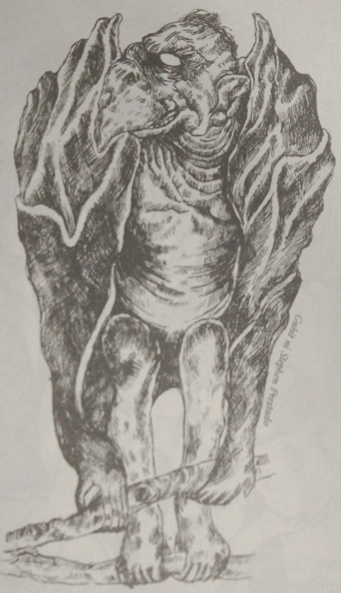                   | [Alan](./Lower%20Mythology/Alan.md)                   | [Lamanlupa](./Classifications/Samar%20Taxonomy/Lamanlupa.md) | \-             | [Changing](Changing.md)                                                          | <ul><li>[Tinguian](Tinguian.md)</li><li>[Isneg](Isneg.md)</li></ul>                                                                                                                               | <ul><li>[Humanoid](Humanoid.md)</li><li>[Winged Creatures](Winged%20Creatures.md)</li><li>[Flying Creatures](Flying%20Creatures.md)</li></ul>                             | <ul><li>[Female](Female.md)</li><li>[Male](Male.md)</li></ul> | [Land](Land.md)                                                    | [Changing](Changing.md)                                                          | [Mga Nilalang na Kagila-gilalas](../Library/Reference%20Books/Mga%20Nilalang%20na%20Kagila-gilalas.md) |
| 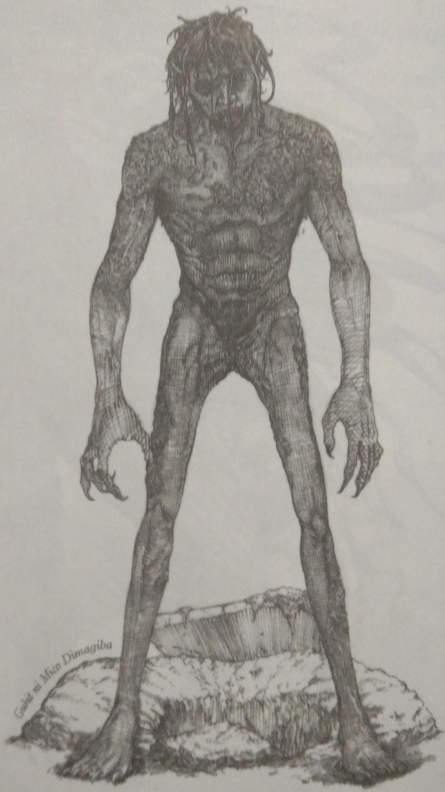            | [Amalanhig](./Lower%20Mythology/Amalanhig.md)         | [Aswangs](./Lower%20Mythology/Aswangs.md)                    | \-             | [Harmful](Harmful.md)                                                            | [Waray](Waray.md)                                                                                                                                                                                  | <ul><li>[Humanoid](Humanoid.md)</li><li>[Undead](Undead.md)</li></ul>                                                                                                 | [Unknown Gender](Unknown%20Gender.md)                            | <ul><li>[Land](Land.md)</li><li>[Forests](Forests.md)</li></ul>   | [Harmful](Harmful.md)                                                            | [Mga Nilalang na Kagila-gilalas](../Library/Reference%20Books/Mga%20Nilalang%20na%20Kagila-gilalas.md) |
| 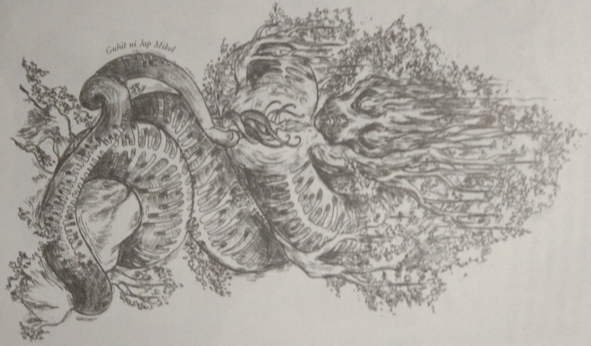             | [Ambaboy](./Lower%20Mythology/Ambaboy.md)             | [Lamanlupa](./Classifications/Samar%20Taxonomy/Lamanlupa.md) | \-             | [Changing](Changing.md)                                                          | <ul><li>[Igorot](Igorot.md)</li><li>[Ifugao](Ifugao.md)</li></ul>                                                                                                                                 | <ul><li>[Animal Form](Animal%20Form.md)</li><li>[Guardians](Guardians.md)</li></ul>                                                                                     | [Unknown Gender](Unknown%20Gender.md)                            | [Land](Land.md)                                                    | [Changing](Changing.md)                                                          | [Mga Nilalang na Kagila-gilalas](../Library/Reference%20Books/Mga%20Nilalang%20na%20Kagila-gilalas.md) |
| 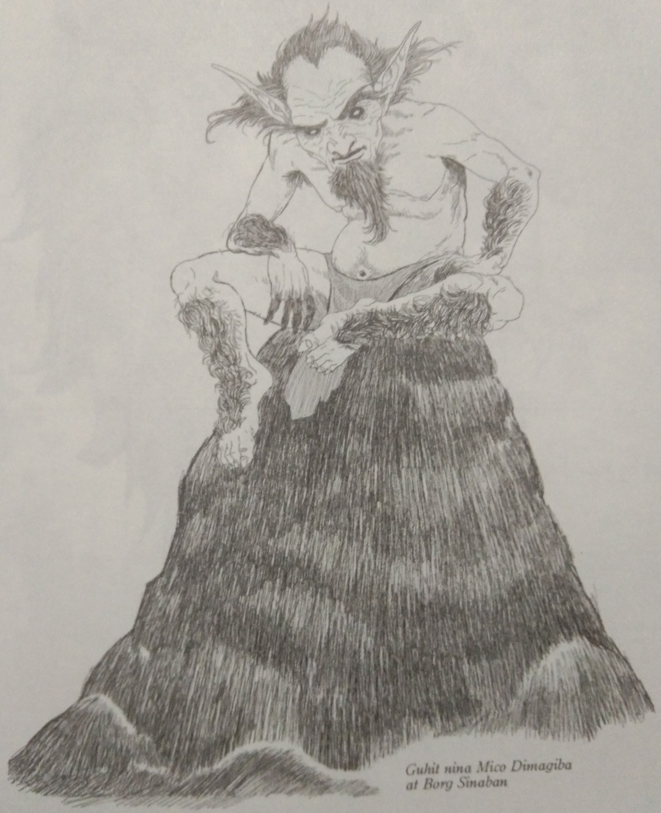             | [Ansisit](./Lower%20Mythology/Ansisit.md)             | [Lamanlupa](./Classifications/Samar%20Taxonomy/Lamanlupa.md) | \-             | [Changing](Changing.md)                                                          | [Ilokano](Ilokano.md)                                                                                                                                                                              | <ul><li>[Humanoid](Humanoid.md)</li><li>[Dwarfish](Dwarfish.md)</li></ul>                                                                                             | [Unknown Gender](Unknown%20Gender.md)                            | [Land](Land.md)                                                    | [Changing](Changing.md)                                                          | [Mga Nilalang na Kagila-gilalas](../Library/Reference%20Books/Mga%20Nilalang%20na%20Kagila-gilalas.md) |
| 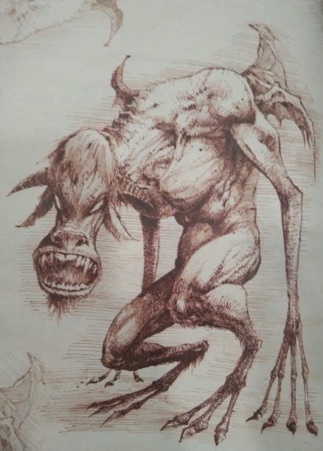                  | [Aswangs](./Lower%20Mythology/Aswangs.md)             | [Aswang](./Classifications/Samar%20Taxonomy/Aswang.md)       | \-             | [Harmful](Harmful.md)                                                            | \-                                                                                                                                                                                                | <ul><li>[Humanoid](Humanoid.md)</li><li>[Hybrids](Hybrids.md)</li><li>[Shapeshifters](Shapeshifters.md)</li><li>[Flying Creatures](Flying%20Creatures.md)</li></ul>     | <ul><li>[Female](Female.md)</li><li>[Male](Male.md)</li></ul> | <ul><li>[Land](Land.md)</li><li>[Air](Air.md)</li></ul>           | [Harmful](Harmful.md)                                                            | \-                                                                                            |
| 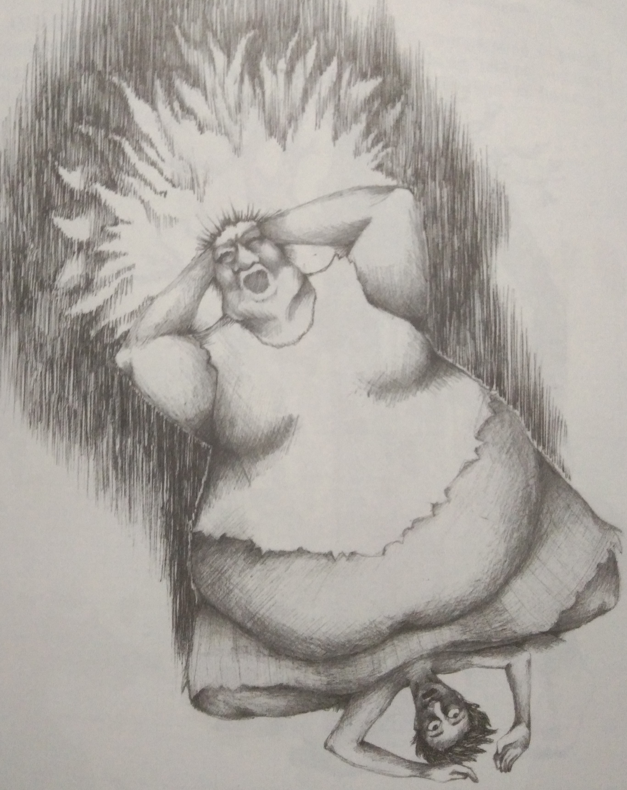             | [Batibat](./Lower%20Mythology/Batibat.md)             | [Lamanlupa](./Classifications/Samar%20Taxonomy/Lamanlupa.md) | \-             | [Harmful](Harmful.md)                                                            | [Ilokano](Ilokano.md)                                                                                                                                                                              | [Humanoid](Humanoid.md)                                                                                                                                                | [Female](Female.md)                                            | [Land](Land.md)                                                    | [Harmful](Harmful.md)                                                            | [Mga Nilalang na Kagila-gilalas](../Library/Reference%20Books/Mga%20Nilalang%20na%20Kagila-gilalas.md) |
| 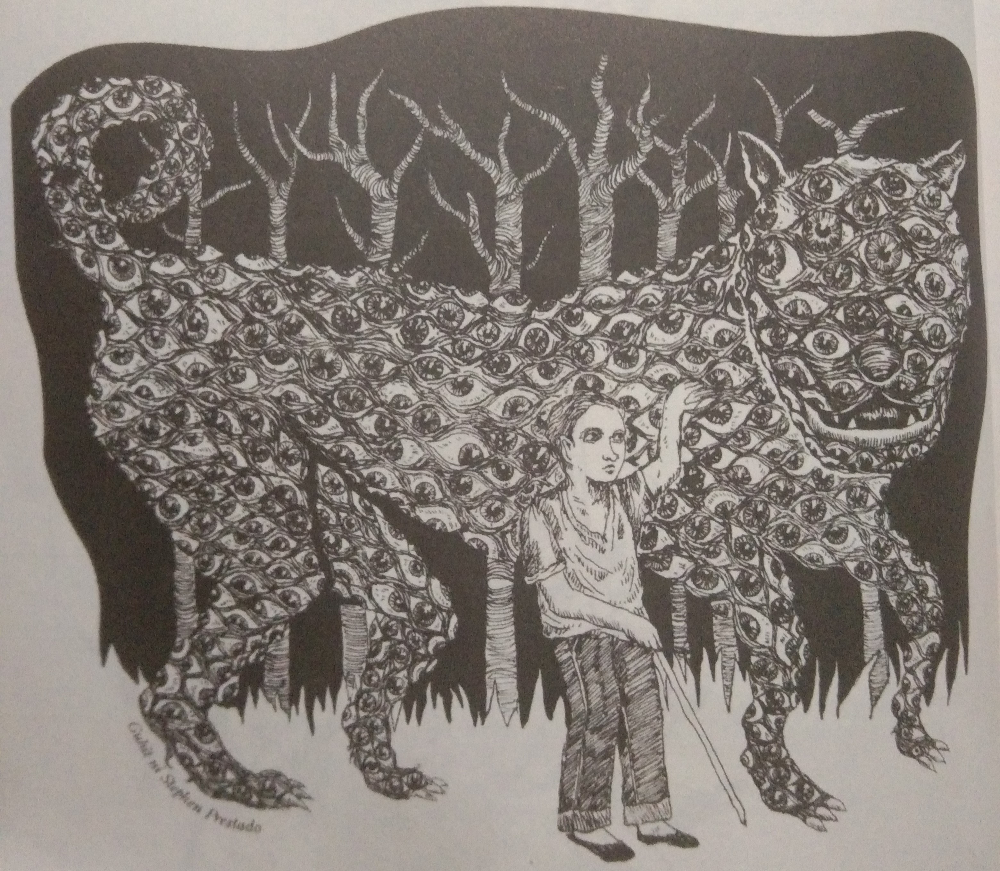         | [Daligmata](./Lower%20Mythology/Daligmata.md)         | [Lamanlupa](./Classifications/Samar%20Taxonomy/Lamanlupa.md) | \-             | [Changing](Changing.md)                                                          | [Visayan](Visayan.md)                                                                                                                                                                              | [Animal Form](Animal%20Form.md)                                                                                                                                          | [Unknown Gender](Unknown%20Gender.md)                            | [Land](Land.md)                                                    | [Changing](Changing.md)                                                          | [Mga Nilalang na Kagila-gilalas](../Library/Reference%20Books/Mga%20Nilalang%20na%20Kagila-gilalas.md) |
| 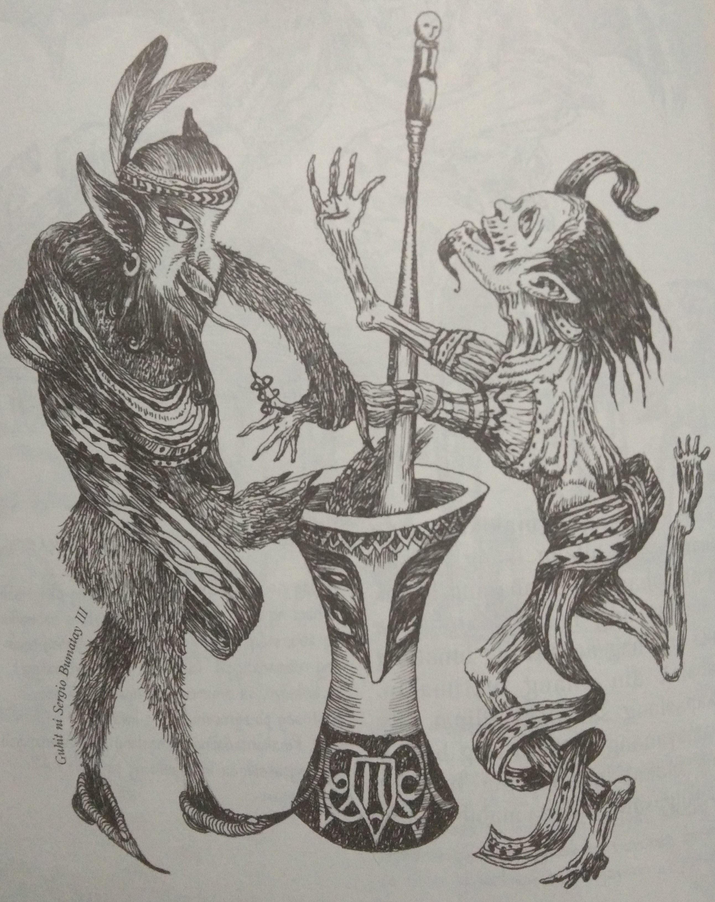                    | [Danag](./Lower%20Mythology/Danag.md)                 | [Aswang](./Classifications/Samar%20Taxonomy/Aswang.md)       | \-             | [Harmful](Harmful.md)                                                            | [Isneg](Isneg.md)                                                                                                                                                                                  | [Humanoid](Humanoid.md)                                                                                                                                                | [Unknown Gender](Unknown%20Gender.md)                            | [Land](Land.md)                                                    | [Harmful](Harmful.md)                                                            | [Mga Nilalang na Kagila-gilalas](../Library/Reference%20Books/Mga%20Nilalang%20na%20Kagila-gilalas.md) |
| 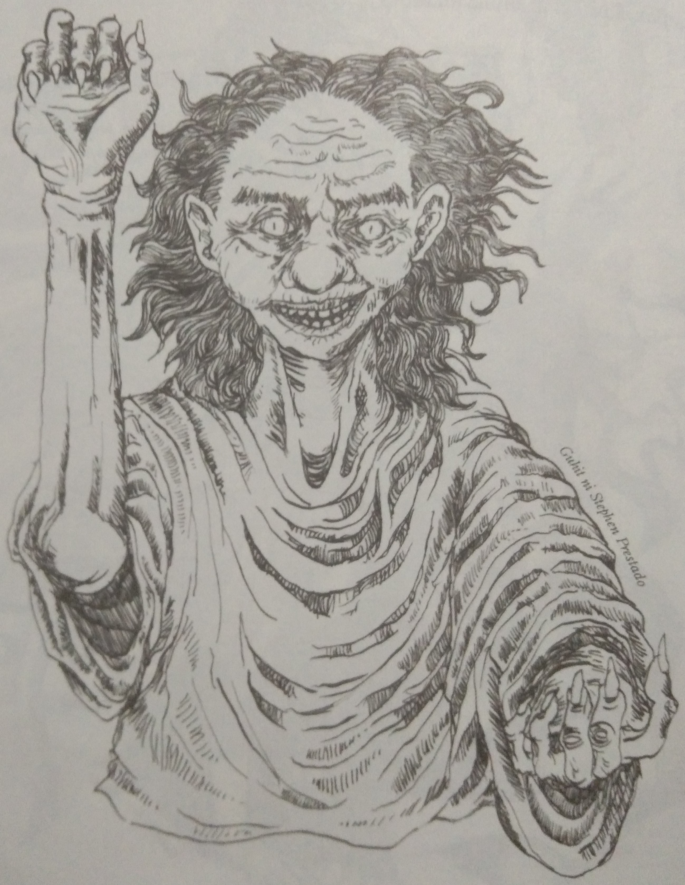              | [Hukluban](./Lower%20Mythology/Hukluban.md)           | [Aswang](./Classifications/Samar%20Taxonomy/Aswang.md)       | \-             | [Harmful](Harmful.md)                                                            | [Tagalog](Tagalog.md)                                                                                                                                                                              | <ul><li>[Humanoid](Humanoid.md)</li><li>[Shapeshifters](Shapeshifters.md)</li></ul>                                                                                   | [Female](Female.md)                                            | <ul><li>[Land](Land.md)</li><li>[Kasanaan](Kasanaan.md)</li></ul> | [Harmful](Harmful.md)                                                            | [Mga Nilalang na Kagila-gilalas](../Library/Reference%20Books/Mga%20Nilalang%20na%20Kagila-gilalas.md) |
| 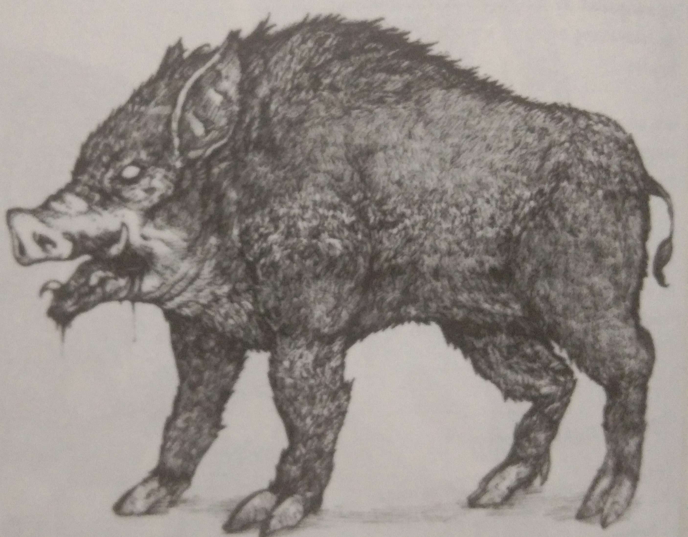                    | [Kiwig](./Lower%20Mythology/Kiwig.md)                 | [Aswang](./Classifications/Samar%20Taxonomy/Aswang.md)       | \-             | [Harmful](Harmful.md)                                                            | [Aklan](Aklan.md)                                                                                                                                                                                  | <ul><li>[Humans](Humans.md)</li><li>[Shapeshifters](Shapeshifters.md)</li></ul>                                                                                       | <ul><li>[Male](Male.md)</li><li>[Female](Female.md)</li></ul> | [Land](Land.md)                                                    | [Harmful](Harmful.md)                                                            | [Mga Nilalang na Kagila-gilalas](../Library/Reference%20Books/Mga%20Nilalang%20na%20Kagila-gilalas.md) |
| 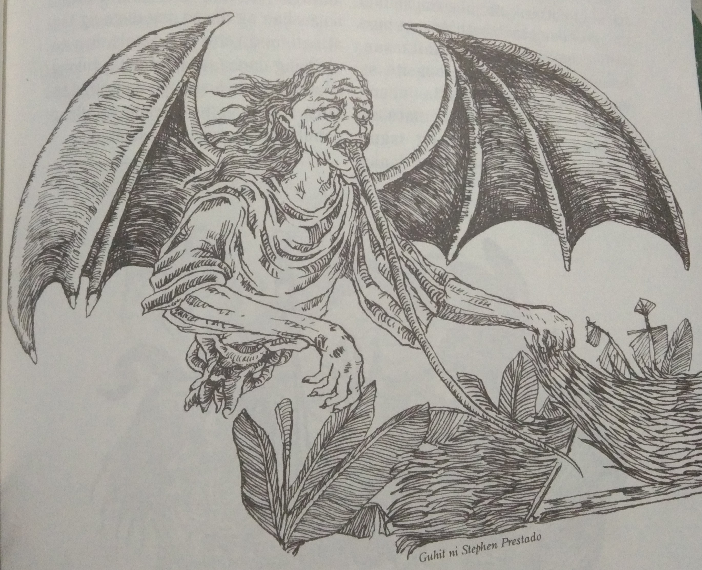        | [Manananggal](./Lower%20Mythology/Manananggal.md)     | [Aswang](./Classifications/Samar%20Taxonomy/Aswang.md)       | \-             | [Harmful](Harmful.md)                                                            | <ul><li>[Visayan](Visayan.md)</li><li>[Bikolano](Bikolano.md)</li><li>[Cuyonen](Cuyonen.md)</li><li>[Ilokano](Ilokano.md)</li><li>[Hiligaynon](Hiligaynon.md)</li><li>[Waray](Waray.md)</li></ul> | <ul><li>[Winged Creatures](Winged%20Creatures.md)</li><li>[Flying Creatures](Flying%20Creatures.md)</li><li>[Humans](Humans.md)</li><li>[Humanoid](Humanoid.md)</li></ul> | [Female](Female.md)                                            | [Land](Land.md)                                                    | [Harmful](Harmful.md)                                                            | [Mga Nilalang na Kagila-gilalas](../Library/Reference%20Books/Mga%20Nilalang%20na%20Kagila-gilalas.md) |
| 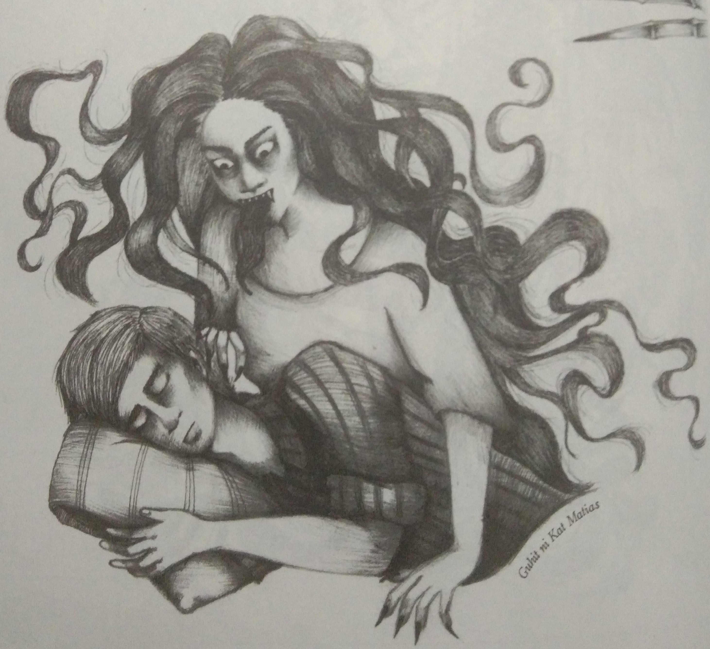            | [Mandurugo](./Lower%20Mythology/Mandurugo.md)         | [Aswang](./Classifications/Samar%20Taxonomy/Aswang.md)       | \-             | [Harmful](Harmful.md)                                                            | [Tagalog](Tagalog.md)                                                                                                                                                                              | [Humans](Humans.md)                                                                                                                                                    | [Female](Female.md)                                            | [Land](Land.md)                                                    | [Harmful](Harmful.md)                                                            | [Mga Nilalang na Kagila-gilalas](../Library/Reference%20Books/Mga%20Nilalang%20na%20Kagila-gilalas.md) |
| 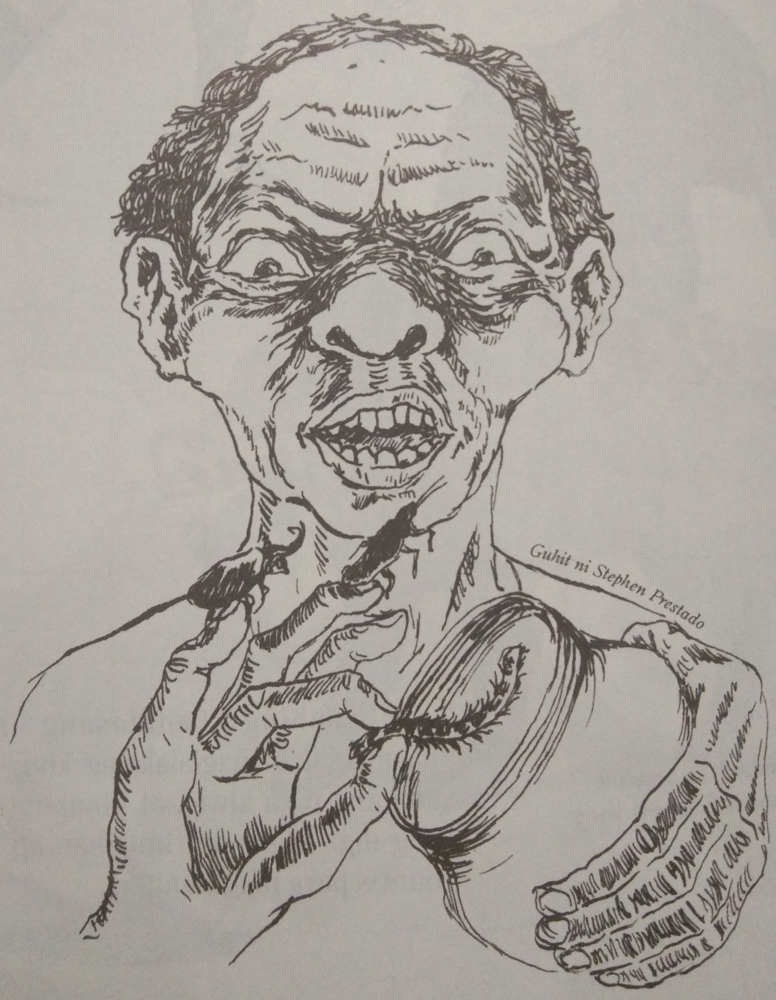        | [Mambabarang](./Lower%20Mythology/Mambabarang.md)     | [Aswang](./Classifications/Samar%20Taxonomy/Aswang.md)       | \-             | [Harmful](Harmful.md)                                                            | <ul><li>[Bikolano](Bikolano.md)</li><li>[Waray](Waray.md)</li></ul>                                                                                                                               | [Humans](Humans.md)                                                                                                                                                    | <ul><li>[Male](Male.md)</li><li>[Female](Female.md)</li></ul> | [Land](Land.md)                                                    | [Harmful](Harmful.md)                                                            | [Mga Nilalang na Kagila-gilalas](../Library/Reference%20Books/Mga%20Nilalang%20na%20Kagila-gilalas.md) |
| 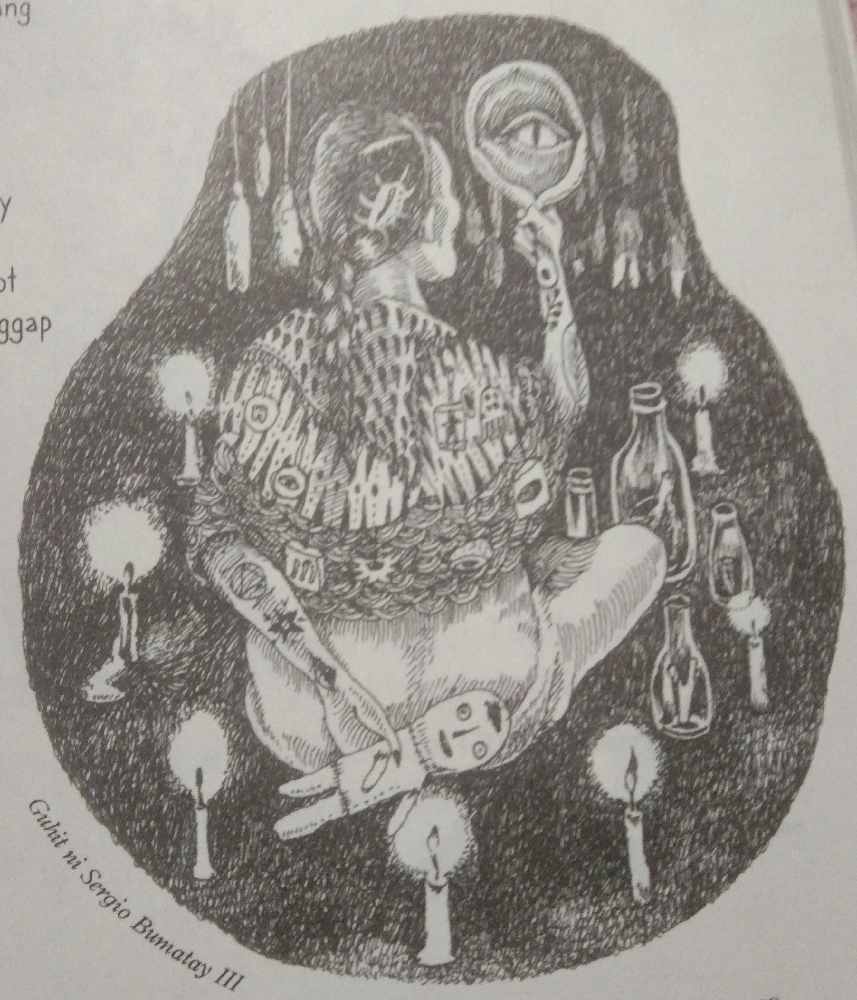        | [Mangkukulam](./Lower%20Mythology/Mangkukulam.md)     | [Aswang](./Classifications/Samar%20Taxonomy/Aswang.md)       | \-             | [Harmful](Harmful.md)                                                            | <ul><li>[Ilokano](Ilokano.md)</li><li>[Pangasinense](Pangasinense.md)</li><li>[Zambal](Zambal.md)</li><li>[Visayan](Visayan.md)</li></ul>                                                         | [Humans](Humans.md)                                                                                                                                                    | <ul><li>[Male](Male.md)</li><li>[Female](Female.md)</li></ul> | [Land](Land.md)                                                    | [Harmful](Harmful.md)                                                            | [Mga Nilalang na Kagila-gilalas](../Library/Reference%20Books/Mga%20Nilalang%20na%20Kagila-gilalas.md) |
| 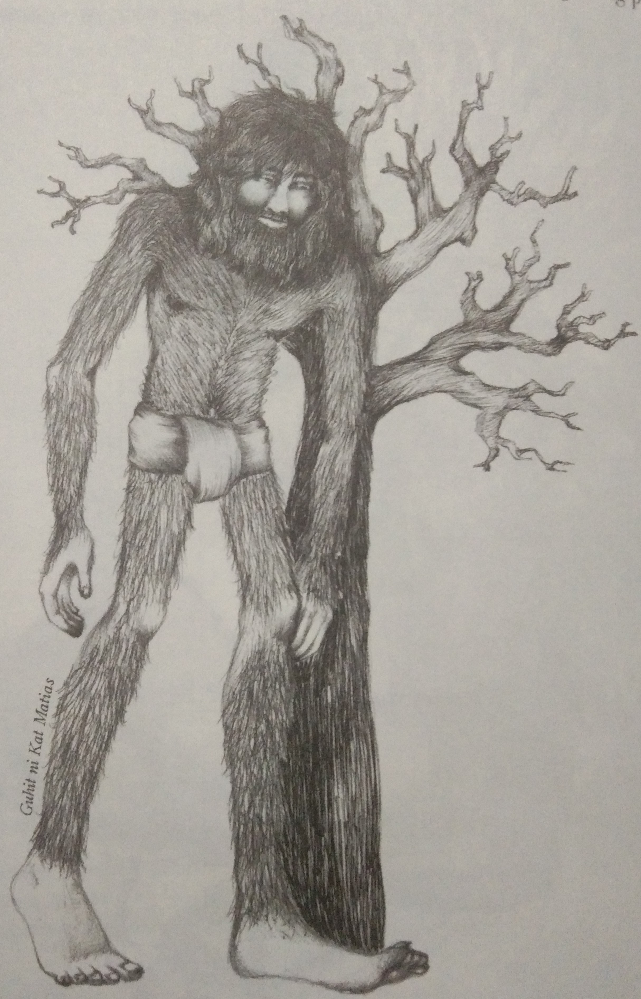               | [Mantiw](./Lower%20Mythology/Mantiw.md)               | [Lamanlupa](./Classifications/Samar%20Taxonomy/Lamanlupa.md) | \-             | <ul><li>[Neutral](Neutral.md)</li><li>[Mischievous](Mischievous.md)</li></ul>   | [Kinaray-a](Kinaray-a.md)                                                                                                                                                                          | [Humanoid](Humanoid.md)                                                                                                                                                | [Unknown Gender](Unknown%20Gender.md)                            | [Land](Land.md)                                                    | <ul><li>[Neutral](Neutral.md)</li><li>[Mischievous](Mischievous.md)</li></ul>   | [Mga Nilalang na Kagila-gilalas](../Library/Reference%20Books/Mga%20Nilalang%20na%20Kagila-gilalas.md) |
| 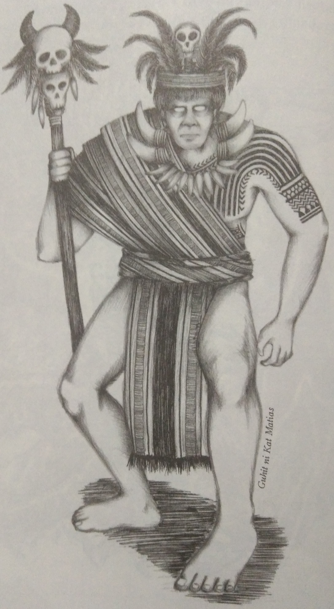             | [Masiken](./Lower%20Mythology/Masiken.md)             | [Lamanlupa](./Classifications/Samar%20Taxonomy/Lamanlupa.md) | \-             | [Friendly](Friendly.md)                                                          | <ul><li>[Igorot](Igorot.md)</li><li>[Ifugao](Ifugao.md)</li></ul>                                                                                                                                 | [Humans](Humans.md)                                                                                                                                                    | [Male](Male.md)                                                | [Land](Land.md)                                                    | [Friendly](Friendly.md)                                                          | [Mga Nilalang na Kagila-gilalas](../Library/Reference%20Books/Mga%20Nilalang%20na%20Kagila-gilalas.md) |
|  | [Nuno sa Punso](./Lower%20Mythology/Nuno%20sa%20Punso.md) | [Lamanlupa](./Classifications/Samar%20Taxonomy/Lamanlupa.md) | \-             | [Changing](Changing.md)                                                          | [Laguna](Laguna.md)                                                                                                                                                                                | [Dwarfish](Dwarfish.md)                                                                                                                                                | [Unknown Gender](Unknown%20Gender.md)                            | [Land](Land.md)                                                    | [Changing](Changing.md)                                                          | [Mga Nilalang na Kagila-gilalas](../Library/Reference%20Books/Mga%20Nilalang%20na%20Kagila-gilalas.md) |
| 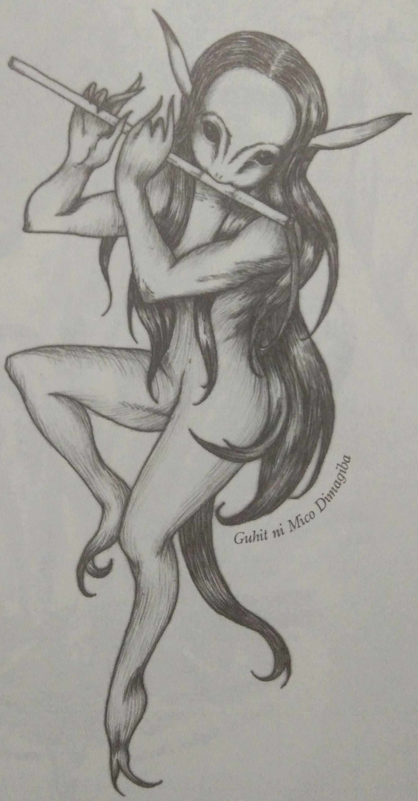               | [Tamawo](./Lower%20Mythology/Tamawo.md)               | [Lamanlupa](./Classifications/Samar%20Taxonomy/Lamanlupa.md) | \-             | <ul><li>[Friendly](Friendly.md)</li><li>[Mischievous](Mischievous.md)</li></ul> | [Hiligaynon](Hiligaynon.md)                                                                                                                                                                        | <ul><li>[Humanoid](Humanoid.md)</li><li>[Shapeshifters](Shapeshifters.md)</li><li>[Invisible](Invisible.md)</li><li>[Animal Form](Animal%20Form.md)</li></ul>           | [Unknown Gender](Unknown%20Gender.md)                            | [Land](Land.md)                                                    | <ul><li>[Friendly](Friendly.md)</li><li>[Mischievous](Mischievous.md)</li></ul> | [Mga Nilalang na Kagila-gilalas](../Library/Reference%20Books/Mga%20Nilalang%20na%20Kagila-gilalas.md) |
| 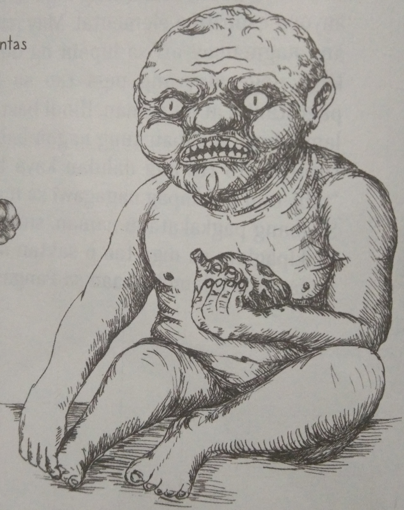             | [Tiyanak](./Lower%20Mythology/Tiyanak.md)             | [Lamanlupa](./Classifications/Samar%20Taxonomy/Lamanlupa.md) | \-             | [Harmful](Harmful.md)                                                            | <ul><li>[Mandaya](Mandaya.md)</li><li>[Bagobo](Bagobo.md)</li></ul>                                                                                                                               | <ul><li>[Humanoid](Humanoid.md)</li><li>[Shapeshifters](Shapeshifters.md)</li><li>[Invisible](Invisible.md)</li><li>[Flying Creatures](Flying%20Creatures.md)</li></ul> | [Unknown Gender](Unknown%20Gender.md)                            | [Land](Land.md)                                                    | [Harmful](Harmful.md)                                                            | [Mga Nilalang na Kagila-gilalas](../Library/Reference%20Books/Mga%20Nilalang%20na%20Kagila-gilalas.md) |
| 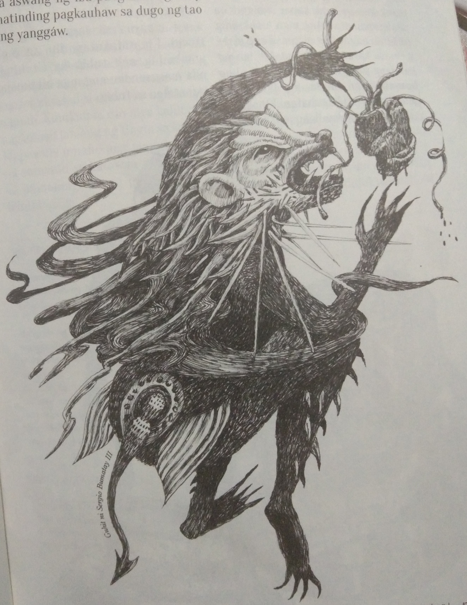                | [Yanggaw](./Lower%20Mythology/Yanggaw.md)             | [Aswang](./Classifications/Samar%20Taxonomy/Aswang.md)       | \-             | [Harmful](Harmful.md)                                                            | [Hiligaynon](Hiligaynon.md)                                                                                                                                                                        | <ul><li>[Humans](Humans.md)</li><li>[Humanoid](Humanoid.md)</li></ul>                                                                                                 | <ul><li>[Female](Female.md)</li><li>[Male](Male.md)</li></ul> | [Land](Land.md)                                                    | [Harmful](Harmful.md)                                                            | [Mga Nilalang na Kagila-gilalas](../Library/Reference%20Books/Mga%20Nilalang%20na%20Kagila-gilalas.md) |

